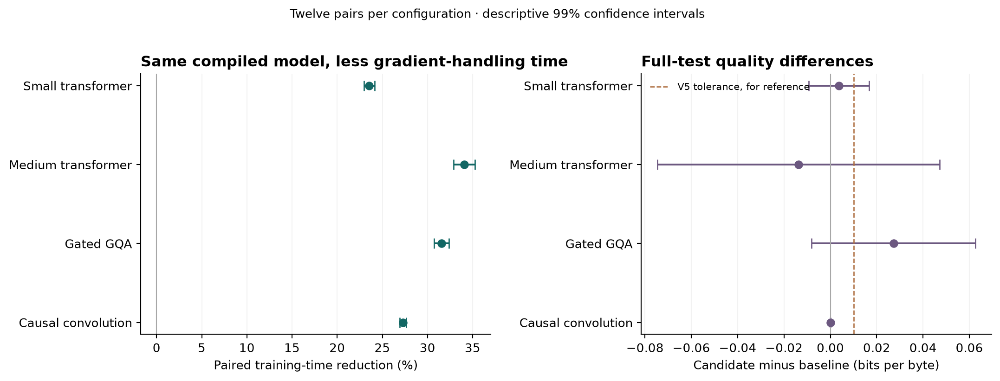
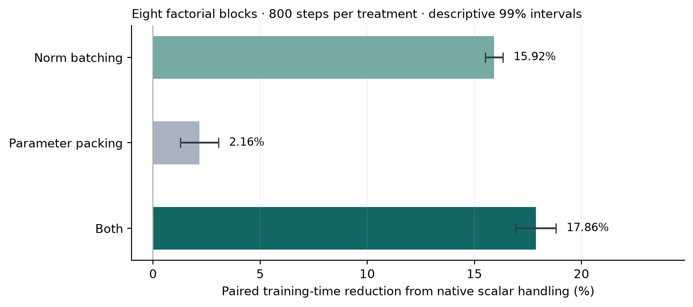

# Cotangent

Numerically matched gradient batching for efficient training on Apple Metal.

Cotangent studies the work between backward and the next parameter update:
gradient norms, clipping and fused AdamW dispatch. It retains the full gradients,
batches equal-length norm reductions, and consistently packs optimizer coordinates.

[Paper](paper/manuscript.pdf) · [Abstract and citation](https://atilavahedian.github.io/cotangent/paper.html) · [Project page](https://atilavahedian.github.io/cotangent/) ·
[LaTeX](paper/manuscript.tex) · [Results](artifacts/v6/analysis/results.json) ·
[Reproduce](docs/REPRODUCING.md)

## Results

The independent eager replication contains **100 paired seeds / 200 runs**.
Time to the fixed quality target fell **15.03% (99.5% CI, 13.50–16.56%)**;
fixed-budget training time fell **16.97% (16.26–17.69%)**. The upper full-test
degradation bound, **0.00728 BPB**, is below the predeclared **0.01-BPB** tolerance.

The stronger extension adds **128 runs**: 32 factorial treatments and 96
architecture comparisons. Its baseline screening selected TorchInductor for
all four configurations. Both arms therefore use the **same compiled model**;
Cotangent changes gradient handling after backward.

| Configuration | Parameters | Training-time reduction | 99% interval | Mean test change |
| --- | ---: | ---: | ---: | ---: |
| Small transformer | 3.35M | 23.55% | 22.97–24.13% | +0.00365 BPB |
| Medium transformer | 19.28M | 34.07% | 32.87–35.26% | -0.01382 BPB |
| Gated GQA | 9.74M | 31.55% | 30.73–32.37% | +0.02723 BPB |
| Causal convolution | 3.75M | 27.30% | 26.95–27.64% | -0.00000 BPB |

These are per-configuration descriptive paired intervals from twelve seeds,
1,200 steps per arm. Positive test change means worse quality. Full intervals,
absolute times, memory observations and every adverse pair are in the
[paper](paper/manuscript.pdf) and [raw records](artifacts/v6/analysis/pairs.csv).
The descriptive quality interval extends above 0.01 BPB for Small transformer, Medium transformer, Gated GQA. The narrow tolerance is therefore not established for every configuration.



## What accounts for the saving

The eight-block factorial experiment separates norm batching from parameter
packing. Norm batching alone saves **15.92%**,
packing alone **2.16%**, and their
combination **17.86%** on the eager small model.
The complete main effects and interaction retain all four treatments.



Native clipping first computes a norm for every parameter, then combines those
scalar norms. A bucket view of **B × (K/2) × 2** keeps the pinned MPS generic
reduction path for tested even lengths. Scalar norms return to parameter order
before the original joint norm. Short and odd lengths use native fallbacks.
Complete gradients are then concatenated, clipped and updated with native
fused AdamW. Every copy and temporary buffer counts.

[Method and mathematical argument](docs/BATCHING.md) ·
[Extension design](docs/EXTENSION.md) · [Related work](docs/RELATED_WORK.md)

## Numerical checks

- 128 full-model extension checks: four configurations, FP32/BF16 forward
  precision, four treatments and four consecutive updates. Losses, gradients,
  clipping norms, parameters and both moment buffers match the reference bitwise.
- 288 norm cases: 32 lengths, three bucket sizes and three gradient dtypes.
- 16 compiler composition checks with matched deterministic derivatives.
- Seven earlier full-training controlled pairs finish with identical model
  hashes and evaluation scores.
- Every one of 128 extension snapshots is restored and checked locally.
  **All weight files remain local.**

Controlled checks isolate update arithmetic. Performance runs retain native
embedding backward, whose accumulation can vary across executions.

## Reproduce the public evidence

The standard-library audit requires no GPU, dataset download or weights:

```sh
python3 analysis/v6/public_audit.py
```

It verifies immutable source and record hashes and independently recomputes the
paired statistics. It does not execute Metal training or inspect local snapshots.
For complete record-based analysis:

```sh
python3 -m venv .venv
.venv/bin/python -m pip install -r requirements-research.txt
.venv/bin/python -m analysis.v5.analyze --records-only
.venv/bin/python -m analysis.v6.analyze --records-only
```

Fresh training uses a separate checkout at **protocol-v6**, which predates its
official outcomes. Published observations and frozen sources must remain intact.
[Training and paper reproduction](docs/REPRODUCING.md).

## Scope

One Apple M5 Pro, PyTorch 2.14.1 MPS, byte language models from 3.35M to 19.28M
parameters, and reused WikiText-2 splits. Compiler measurements use warm caches
and per-step synchronization. Gradient handling and native fused AdamW remain
outside the compiled model call. Dense contiguous complete gradients and one
hyperparameter group are required. Full activations and derivative products
remain; additional buffers consume memory.

Other Apple devices, CUDA, distributed training and larger model scales remain
untested. The V5 quality decision and V6 descriptive comparisons have different
roles. [The experimental record](docs/EXPERIMENTS.md) preserves earlier failures.

## Repository

| Path | Contents |
| --- | --- |
| paper/ | Standalone LaTeX manuscript and PDF |
| research/v4/ | Frozen reference implementation |
| research/v6/ | Frozen ablations, architectures and compiler composition |
| analysis/v6/ | Statistics, independent audit, figures and publication tools |
| artifacts/v5/ and artifacts/v6/ | Protocols and complete measurement records |
| docs/ | Method, reproduction instructions and project page |

Research by **Atila Vahedian**. [Citation](CITATION.cff).
Code and authored report are MIT licensed. Dependencies and dataset retain their
terms; corpus content and model weights are not redistributed.
